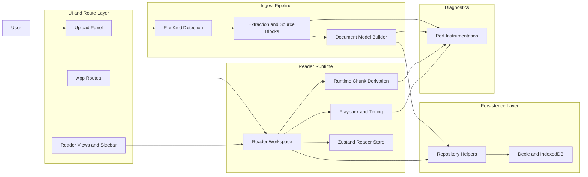
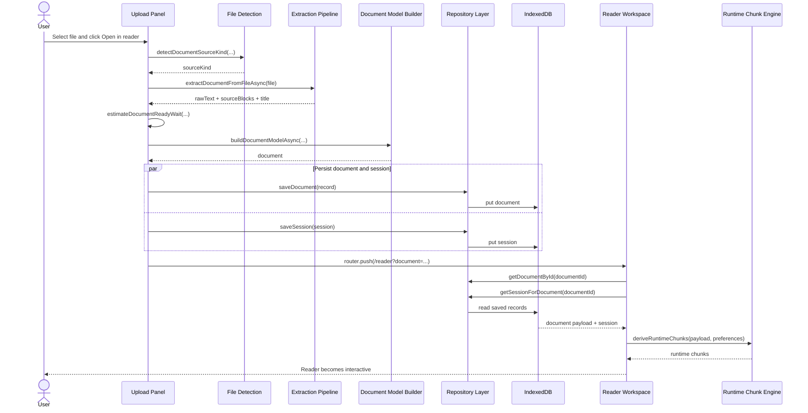
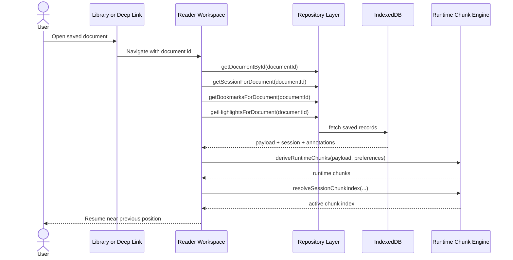
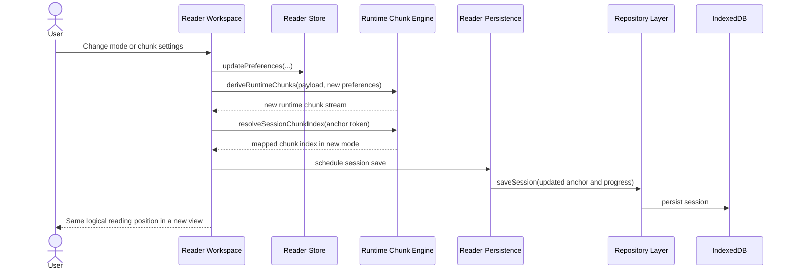

# Leyendo

Leyendo is a local-first reading web app for people who want help reading dense text faster without giving up control, comfort, or privacy.

In plain language, the app does five things:

- it accepts pasted text or supported files,
- it turns that input into a structured reading model,
- it opens the content in one of several guided reading modes,
- it remembers progress, bookmarks, highlights, and preferences locally by default,
- and it can optionally sync a signed-in user library across devices through Supabase while still keeping document processing in the browser.

This README is meant for two audiences at the same time:

- beginners who want to understand what the system does and why it is built this way,
- advanced developers who want an accurate map of the codebase, tradeoffs, and performance behavior.

## The Short Version

If you only want the quick mental model, this is it:

1. A user pastes text or uploads a file.
2. Leyendo detects the input type.
3. The browser extracts readable text from that input.
4. The app builds a `DocumentModel` with blocks, sentences, tokens, chunks, and sections.
5. That model is saved to IndexedDB on the device.
6. The Reader route loads the saved model, derives mode-specific runtime chunks, and starts reading.
7. Progress, bookmarks, highlights, and preferences are saved locally so the same browser can resume later.
8. If the user signs in, Leyendo can sync that library and reading state across devices.

That is the whole architecture in one flow.

## What Problem Leyendo Is Trying To Solve

A lot of speed-reading products optimize for one thing only: showing words faster. Real reading is messier than that.

People lose their place. They need to slow down for difficult sections. They want to highlight something, pause, come back later, or switch to a calmer layout when a document gets tiring. They also may not want to upload private PDFs, essays, or notes to a remote service.

Leyendo is built around a different idea: faster reading support should still feel readable, interruptible, and private.

## What Users Can Do Today

Right now a user can:

- paste text directly into the app,
- upload PDF, DOCX, RTF, Markdown, or TXT files,
- choose a reading goal,
- open the content in the Reader,
- switch between four reading modes,
- change pace and display settings,
- save bookmarks and highlights,
- resume from the local library,
- sign in to sync a library across devices when Supabase is configured,
- remove a document and its related local reading data.

## Optional Account Sync

Leyendo still works without an account.

Guest users keep the original local-first behavior:

- document extraction and model building happen in the browser,
- the library is stored in IndexedDB on that device,
- progress, bookmarks, highlights, and preferences stay local.

When Supabase is configured and the user signs in, Leyendo can also mirror these records to the cloud:

- document records,
- reading sessions,
- bookmarks,
- highlights,
- a lightweight profile row used to keep the account self-healing.

The cloud copy is there for cross-device resume. The import pipeline itself still runs locally in the browser.

## Supported Inputs And Honest Limits

### Supported now

- pasted text,
- `.txt`,
- `.md` and `.markdown`,
- `.docx`,
- `.rtf`,
- `.pdf` with selectable text.

### Not supported now

- legacy `.doc` Word files,
- scanned or image-only PDFs that require OCR,
- cloud import sources,
- anonymous cloud import sources,
- backup import and export.

### Current practical limits in code

These are the important implementation thresholds today:

- PDFs larger than `150_000_000` bytes are rejected before extraction starts.
- Document-model building offloads to a worker at `120_000` characters and above.
- Document-model worker builds time out after `90_000` ms.
- PDF extraction timeout is `420_000` ms.

One detail matters a lot for understanding current performance behavior:

- PDF extraction worker offload is also currently set to `150_000_000` bytes.

That means the worker threshold is effectively the same as the browser PDF size cap. In practice, most accepted PDFs extract on the main thread. That is intentional in the current codebase because the dedicated PDF worker path caused reliability problems for some real-world large files.

## Why Large PDFs Can Take A While On First Open

This is one of the most important things to understand about the app.

When a user uploads a large PDF and clicks `Open in reader` for the first time, the wait is usually not caused by the network. It is mostly caused by browser-side CPU work and local persistence.

The first-open path does all of this before the reader is actually ready:

1. Read the file in the browser.
2. Extract readable text from the PDF with `pdfjs-dist`.
3. Reconstruct a cleaner source structure from the extracted text.
4. Build the full `DocumentModel`.
5. Save the full document payload and the first reading session in IndexedDB.
6. Navigate to the Reader route.
7. Load the saved payload back from IndexedDB.
8. Derive runtime chunks for the selected reading mode.
9. Compute additional reader data such as remaining words and remaining time.

That is why first open is slower than reopening the same document later.

Later opens skip the expensive file extraction and document-model build because the saved payload already exists in IndexedDB. They still need to hydrate the document and derive runtime chunks, but the import step is already done.

### Why the app now shows a wait estimate

Large first opens are not always easy to optimize away in a browser-only architecture. Because of that, the upload flow now shows a stage-aware progress estimate during first open.

The estimate is based on:

- source kind,
- file size,
- extracted text length,
- whether document-model building will offload to a worker.

The goal is not to pretend progress is exact. The goal is to give the user an honest sense of whether the document should be ready in a few seconds or whether they are in a longer browser-side preparation phase.

### What the wait estimate is actually doing

For advanced readers, the estimate is heuristic, not instrumented percent-complete progress.

The current implementation in `src/components/upload/upload-panel.tsx` does this:

- it derives a `normalizedLength` from extracted text length,
- for PDFs, it also uses file size as a fallback signal because PDFs can be expensive before the final cleaned text length is known,
- it calculates a min and max expected wait,
- it clamps that range to between 4 seconds and 90 seconds,
- it changes the visible stage from `structuring` to `saving` once the document model is built,
- it maps elapsed time into a bounded progress bar instead of pretending the browser knows exact real progress.

That last point is important. The progress bar is intentionally a confidence aid, not a claim that the app has exact byte-level or token-level progress information from every internal step.

### Why the estimate can still be wrong sometimes

The estimate can be shorter or longer than reality because browser-local work depends on more than just file size.

Real runtime is affected by:

- device CPU speed,
- browser memory pressure,
- PDF layout complexity,
- IndexedDB serialization cost,
- current tab load,
- whether runtime chunk derivation creates a very large chunk array.

So the correct mental model is: the app gives a plausible wait band, not a guaranteed completion timer.

## Beginner Mental Model Of The System

If you are new to programming, this is the simplest way to think about the internals.

### Step 1: intake

The app accepts either pasted text or a file.

### Step 2: extraction

The app converts that input into readable text and, when possible, preserves useful structure such as headings, list items, alignment, and source page hints.

### Step 3: modeling

The app turns the extracted result into a structured object so the reader does not have to keep re-parsing one giant text blob.

### Step 4: persistence

The structured document and reading session are saved locally in IndexedDB first. When the user signs in, Leyendo can also mirror the library, sessions, bookmarks, and highlights to Supabase.

### Step 5: reader runtime

The Reader screen takes the saved document and derives a mode-specific stream of runtime chunks.

### Step 6: playback and resume

As the user reads, the app updates progress, session anchors, bookmarks, highlights, and preferences locally. Signed-in users can also push that reading state to the cloud for cross-device resume.

That is the whole product loop.

## Subsystem Boundaries

This section is the architecture map in one place. It explains which subsystem owns which part of the work so contributors do not mix concerns accidentally.

### Boundary summary

| Subsystem                 | Owns                                                                                       | Does not own                                    | Main files                                                                                  |
| ------------------------- | ------------------------------------------------------------------------------------------ | ----------------------------------------------- | ------------------------------------------------------------------------------------------- |
| Intake and route UI       | user inputs, status messages, route transitions, mode-specific rendering                   | file parsing internals, database schema design  | `src/components/upload/upload-panel.tsx`, `src/app/`, `src/components/reader/`              |
| Ingest pipeline           | file-kind detection, text extraction, source block reconstruction, document-model building | long-term storage, reader playback state        | `src/features/ingest/detect/`, `src/features/ingest/extract/`, `src/features/ingest/build/` |
| Persistence subsystem     | IndexedDB schema, save/load/delete operations, document/session/bookmark/highlight records | UI timing, chunk derivation, rendering          | `src/db/app-db.ts`, `src/db/repositories.ts`                                                |
| Reader runtime            | runtime chunk derivation, active reading state, playback timing, progress, resume mapping  | raw file extraction, storage schema definitions | `src/components/reader/`, `src/features/reader/engine/`, `src/state/reader-store.ts`        |
| Cross-cutting diagnostics | performance measurements and drift metrics                                                 | business logic ownership                        | `src/lib/perf/instrumentation.ts`                                                           |

### Why these boundaries matter

These boundaries keep the system understandable.

- upload UI can change messaging without rewriting the extractor,
- extraction logic can improve without rewriting reader playback,
- persistence can evolve without forcing mode components to understand Dexie internals,
- reader modes can change chunk behavior without changing how files are imported.

That separation is one of the reasons the codebase can support multiple input formats and multiple reader modes at the same time.

### Subsystem boundary diagram



### Architecture rules of thumb

- `src/components/upload/` may orchestrate import, but it should not absorb file-format-specific extraction logic.
- `src/features/ingest/` may prepare a `DocumentModel`, but it should not decide how the Reader renders a mode.
- `src/db/` may persist and query records, but it should not know how runtime chunks are derived.
- `src/features/reader/engine/` may derive reading behavior, but it should not know how PDFs or DOCX files are parsed.

If a change crosses more than one of those boundaries, that is usually a sign that the design impact needs extra scrutiny.

## End-To-End Flow In Code

This section maps the architecture to the actual code areas.

### 1. Input detection

`src/features/ingest/detect/file-kind.ts` decides whether an upload is PDF, DOCX, RTF, Markdown, plain text, or unsupported.

Important behavior:

- legacy `.doc` is rejected,
- strict detection is intentional,
- arbitrary `text/*` uploads are not accepted just because they are text-like.

### 2. File extraction

`src/features/ingest/extract/file-text.ts` contains the extraction logic.

Current extraction approach:

- TXT: direct text extraction,
- Markdown: plain text plus later structure recovery,
- DOCX: Mammoth browser extraction,
- RTF: internal lightweight browser parser,
- PDF: `pdfjs-dist` text extraction plus structure reconstruction.

The PDF path does more than just concatenate text. It tries to infer useful reading structure by grouping lines into paragraphs, recognizing headings, preserving list markers, and inserting image placeholders where appropriate. It does not try to preserve the exact visual page layout.

### 3. Structured block normalization

`src/features/ingest/normalize/markdown-blocks.ts` is the worker-safe Markdown block extractor.

This matters because the active import path no longer depends on the old `unified` and `remark` pipeline to build Markdown blocks during worker-friendly model construction. The repo still contains those dependencies, but the core import path now uses the internal parser so worker builds do not pull DOM-dependent browser code.

### 4. Document-model build

`src/features/ingest/build/document-model.ts` turns raw text or source blocks into a `DocumentModel`.

That model contains:

- `blocks`: headings, paragraphs, and list items,
- `sentences`: sentence boundaries used for reading flow,
- `tokens`: word-level units with paragraph and sentence anchors,
- `chunks`: a base chunk stream created during model build,
- `sections`: document sections derived mostly from headings.

This structure is important because the Reader should be able to switch behavior without re-importing the file.

### 5. Worker orchestration

`src/features/ingest/build/document-model-client.ts` decides whether model building stays on the main thread or runs in a worker.

The current rule is simple:

- under `120_000` characters, build on the main thread,
- `120_000` characters and above, try a worker build,
- if the worker exceeds the timeout, surface a clear user-facing error.

### 6. Local persistence

`src/db/app-db.ts` defines the Dexie schema and `src/db/repositories.ts` holds the data-access helpers.

Leyendo stores these records locally:

- documents,
- sessions,
- bookmarks,
- highlights,
- reader preferences.

The full document payload lives inside the saved document record so the Reader can reopen the same content later without repeating extraction.

### 7. Reader hydration

`src/components/reader/use-reader-document.ts` loads the saved document, session, bookmarks, and highlights for the Reader route.

This is why opening the same document later is much faster than importing it from the original file again.

### 8. Runtime chunk derivation

`src/features/reader/engine/navigation.ts` derives the chunk stream used by the active reading mode.

This step is one of the most important performance costs on reader load, especially for large documents and especially for modes that create many runtime chunks.

### 9. Reader runtime state

`src/state/reader-store.ts` holds live UI state such as:

- active document id,
- current chunk index,
- playing state,
- reader preferences.

This is runtime state, not durable storage. The durable data still lives in IndexedDB.

### 10. What happens after `router.push("/reader?...")`

The Reader route still has meaningful work to do after navigation.

At a high level, `src/components/reader/reader-workspace.tsx` does this:

1. load the document payload and saved session from IndexedDB,
2. derive runtime chunks for the active mode and settings,
3. calculate current progress,
4. calculate remaining words,
5. calculate estimated remaining reading time,
6. resolve the saved anchor back into the correct runtime chunk,
7. initialize playback and persistence hooks.

This is why the redirect into the Reader is not the same thing as the Reader already being fully interactive.

### Reader hydration details that matter

Some details are easy to miss unless you read the code:

- `deriveRuntimeChunks(...)` is wrapped in `useMemo`, so it only recomputes when the document payload or the relevant preferences change.
- Remaining words are not estimated from plain chunk count. The code walks the remaining runtime chunks and deduplicates token indexes with a `Set`.
- Remaining time is not a fixed words-per-minute division. It uses mode-aware chunk timing rules from `src/features/reader/engine/timing.ts`.
- When mode or chunk settings change, the Reader tries to preserve position by resolving the last anchor token into the new runtime chunk stream.

That last behavior is one of the reasons the Reader feels resilient even when the user changes settings mid-session.

## Sequence Diagrams

The prose above explains the architecture. The diagrams below show the same architecture as ordered interactions.

### Sequence 1: first upload and open in Reader

This is the slowest path because it includes extraction, document-model building, persistence, navigation, and first reader hydration.



### Sequence 2: reopen from local library

This path skips file extraction and model building because the `DocumentModel` already exists in IndexedDB.



### Sequence 3: mode switch during an active session

This path explains why a mode switch can preserve logical position without preserving the same chunk index.



## The `DocumentModel` Explained

The `DocumentModel` is the center of the system.

If you understand this type, the rest of the app gets much easier to follow.

### `blocks`

Blocks are the high-level reading structure. A block is usually a heading, paragraph, or list item.

Use blocks when the UI needs layout-aware context.

### `sentences`

Sentences are used to keep reading flow natural. Some modes should not break in the middle of sentence logic unless they have to.

### `tokens`

Tokens are the word-level units. They are the most important anchors for playback, navigation, resume, bookmarks, and highlights.

### `chunks`

The model stores a base chunk stream, but the Reader can derive new runtime chunk streams later depending on the active mode and settings.

### `sections`

Sections help the library and reader reason about major document boundaries, usually inferred from headings.

## Reading Modes: Product View And Code View

Leyendo currently has four reading modes.

The important architectural idea is that the UI mode is not just a CSS skin. Each mode can derive a different runtime chunk stream from the same saved `DocumentModel`.

### Mode summary

| Mode           | What the user sees                                                         | Core runtime builder       | How it groups text                                                                                           | Main tradeoff                                                   |
| -------------- | -------------------------------------------------------------------------- | -------------------------- | ------------------------------------------------------------------------------------------------------------ | --------------------------------------------------------------- |
| Focus Word     | One active focal word with nearby context dimmed around it                 | `buildFocusWordChunks`     | Creates one runtime chunk per token, with a context window around the anchor token                           | Strong focus, but many runtime chunks on large documents        |
| Phrase Chunk   | Small phrase groups within the active sentence                             | `buildPhraseChunks`        | Accumulates tokens until punctuation, connectors, or size heuristics suggest a phrase boundary               | More natural cadence, but still heuristic                       |
| Guided Line    | One active line-like chunk plus nearby lines from the same paragraph       | `buildGuidedLineChunks`    | Builds chunk groups by target character length and soft boundary rules inside a paragraph                    | Keeps paragraph context, but line grouping is still approximate |
| Classic Reader | Full document view with the active paragraph and active tokens highlighted | `buildClassicReaderChunks` | Splits sentence tokens into fixed-size token groups for navigation while the view still renders whole blocks | Most familiar layout, but less visually aggressive guidance     |

### Focus Word in code

Focus Word is implemented by `buildFocusWordChunks` in `src/features/reader/engine/navigation.ts` and rendered by `src/components/reader/focus-word-view.tsx`.

How it works:

- the engine walks every sentence token by token,
- each token becomes the anchor of its own runtime chunk,
- the runtime chunk also includes nearby context tokens based on `chunkSize` and `focusWindow`,
- the view highlights the anchor token and dims the surrounding tokens.

Why it feels different:

- navigation advances at token granularity,
- the number of runtime chunks can become very large on long documents,
- this is one reason the default first render can be expensive on big texts.

### Phrase Chunk in code

Phrase Chunk is implemented by `buildPhraseChunks` and rendered by `src/components/reader/phrase-chunk-view.tsx`.

How it works:

- tokens are accumulated inside a sentence,
- the engine breaks when it sees terminal punctuation, soft punctuation, connector words, or a target length boundary,
- the view shows the current sentence's phrase chunks with the active phrase emphasized.

Why it feels different:

- it tries to keep phrasing more natural than single-token focus,
- it is still heuristic, not full linguistic parsing,
- the grouping can improve or degrade depending on source text quality.

### Guided Line in code

Guided Line is implemented by `buildGuidedLineChunks` and rendered by `src/components/reader/guided-line-view.tsx`.

How it works:

- the engine groups paragraph tokens into line-like chunks,
- the target chunk length is based on character count, roughly `24 + chunkSize * 10`,
- punctuation and connector heuristics help decide when to break,
- the view shows the active line plus nearby lines inside the same paragraph using `focusWindow`.

Why it feels different:

- it preserves more paragraph context than Focus Word,
- it reduces page scatter better than a full classic page view,
- it is still an approximation of a reading line, not a real typography engine.

### Classic Reader in code

Classic Reader is implemented by `buildClassicReaderChunks` and rendered by `src/components/reader/classic-reader-view.tsx`.

How it works:

- the engine splits sentence tokens into fixed groups by `chunkSize`,
- the view still renders the whole document block structure,
- the active paragraph scrolls into view,
- the active chunk's tokens are highlighted inside that paragraph.

Why it feels different:

- the user keeps more normal document context,
- it is the safest fallback when guided presentation feels too aggressive,
- the navigation logic still uses chunks even though the UI looks more like a normal page.

## Why Mode Switching Works Without Reimporting

Mode switching does not require rebuilding the document from the original file because the imported document is already stored as a structured `DocumentModel`.

The Reader simply derives another runtime chunk stream from the same payload.

This is one of the main architectural wins of the project.

## Why Resume Still Works Across Modes And Chunk Sizes

This is another subtle but important design choice.

Sessions, bookmarks, and highlights do not rely only on raw chunk indexes. They also keep token-level anchors.

That matters because chunk indexes can change when:

- the user switches modes,
- `chunkSize` changes,
- `focusWindow` changes.

The navigation helpers can resolve the current token anchor back into the correct runtime chunk for the current mode. That is why resume behavior survives mode changes much better than a naive chunk-index-only design.

## Local-First Persistence

Leyendo uses IndexedDB through Dexie.

This is the local-first storage model:

- `documents`: saved metadata plus the full document payload,
- `sessions`: last known reading location and progress,
- `bookmarks`: named saved anchors,
- `highlights`: saved quotes and notes,
- `preferences`: reader settings.

Why IndexedDB instead of `localStorage`:

- documents are too large for `localStorage`,
- the data is structured,
- queries such as recent documents or document-linked sessions are easier,
- Dexie makes IndexedDB much more manageable.

### Important compatibility note

The visible product name is now Leyendo, but some internal storage identifiers still use older `lee` naming, such as the Dexie database name `lee-reader-db` and class names like `LeeDatabase`.

That is intentional. Renaming internal storage keys carelessly would break existing saved browser data for returning users.

## Performance Architecture And Tradeoffs

### What the app already does to help performance

- heavy steps are measured with perf instrumentation,
- document-model building can offload to a worker,
- runtime chunks are cached per document and options inside a `WeakMap`,
- first-open save operations now persist document and session in parallel,
- the upload UI shows stage-aware ETA guidance during first open.

### Important current metrics

The perf instrumentation tracks these metric names today:

- `import.extract`,
- `import.build-document`,
- `reader.derive-runtime-chunks`,
- `reader.playback-drift`.

### Why the Reader can still feel expensive on large documents

Even after a document is imported, Reader startup still has real work to do:

- load the document payload from IndexedDB,
- derive the active mode's runtime chunks,
- compute progress,
- compute remaining words and estimated reading time,
- hydrate session anchors, bookmarks, and highlights.

Large documents amplify all of that.

### Why Focus Word is often the most expensive default

The default mode is `focus-word`.

That matters because Focus Word generates one runtime chunk per token anchor, which can create a very large runtime chunk array for long texts. A shorter phrase-based or line-based mode may derive fewer chunks from the same document.

### PDF-specific reality

PDFs are the hardest input type in this project because PDF is primarily a page-description format, not a clean reading-structure format.

The extractor tries to reconstruct headings, paragraphs, lists, and some image placeholders from positioned text fragments, but PDFs with these traits are still difficult:

- multiple columns,
- tables,
- forms,
- dense footnotes,
- page headers and footers,
- broken extraction order,
- poor source encoding.

Leyendo tries to preserve readable content, not exact visual layout.

### How playback timing is calculated

The playback engine is more than a plain `setTimeout(wordsPerMinute)` loop.

`src/features/reader/engine/timing.ts` calculates chunk duration from:

- token count,
- current `wordsPerMinute`,
- `smartPacing`,
- `naturalPauses`,
- `reduceMotion`,
- active mode.

Important behavior in the current code:

- punctuation can slow a chunk down,
- phrase mode adds a small duration multiplier,
- guided-line mode adds a larger multiplier,
- reduce-motion slightly increases duration,
- chunk duration has a minimum floor.

That means remaining-time estimates and autoplay pacing are intentionally shaped by readability rules, not just raw speed settings.

### Why playback drift is measured

The app records `reader.playback-drift` so developers can compare the expected chunk duration with the actual timeout delay seen in the browser.

This is useful because browsers do not always fire timers exactly on schedule. Drift can increase when:

- the tab is busy,
- the machine is under load,
- timers are throttled,
- rendering work is expensive.

That metric helps explain cases where the configured pace feels slower than expected.

## Why This Tech Stack Was Chosen

The stack is practical, not fashionable.

| Technology                        | Role in this project                                    | Why it fits                                                                               |
| --------------------------------- | ------------------------------------------------------- | ----------------------------------------------------------------------------------------- |
| Next.js 16 App Router             | Routing, app shell, production build, React integration | Good structure for a multi-route product even though most heavy processing is client-side |
| React 19                          | UI state and composition                                | Good fit for an interactive reader, upload flow, and local library                        |
| TypeScript                        | Domain modeling and safer refactors                     | Helps keep document, session, bookmark, and reader-mode types coherent                    |
| Tailwind CSS v4                   | Styling system                                          | Fast iteration and consistent UI composition                                              |
| Dexie                             | IndexedDB wrapper                                       | Much easier than raw IndexedDB for local-first structured data                            |
| Zustand                           | Runtime reader state                                    | Small and easy to reason about for active reader state                                    |
| `pdfjs-dist`                      | PDF extraction                                          | The standard browser-side choice for selectable-text PDFs                                 |
| Mammoth                           | DOCX extraction                                         | Reliable browser-side DOCX text extraction                                                |
| Internal RTF parser               | RTF extraction                                          | Avoids backend conversion and avoids fragile client bundling paths                        |
| Internal Markdown block extractor | Markdown structure recovery                             | Keeps the active import path worker-safe                                                  |
| Vitest                            | Unit and component tests                                | Fast feedback for reader logic and UI behavior                                            |
| Playwright                        | End-to-end tests                                        | Covers browser-level reading and import flows                                             |

### Why not a backend first?

Because the current product promise is local-first reading.

A backend-first design would add complexity around:

- authentication,
- privacy,
- API design,
- hosting,
- sync conflicts,
- document ownership.

That might be worth doing later, but it is not required to validate the core reading experience.

### Why not always upgrade to the newest package immediately?

Because compatibility is more important than novelty in a tool that depends on browser APIs, file extraction, build tooling, and test tooling.

The project uses a working version set, not an "always latest" policy.

## Contributor Playbook

This section is for developers who want to change the product, not just understand it.

### How to add a new reader mode

Adding a new mode usually touches four layers:

1. add the mode to `src/types/reader.ts`,
2. teach `deriveRuntimeChunks(...)` in `src/features/reader/engine/navigation.ts` how to build that mode's runtime chunks,
3. add a rendering component in `src/components/reader/`,
4. wire the mode into `src/components/reader/reader-workspace.tsx` and any mode-selection UI.

If the mode should affect pacing, also update `src/features/reader/engine/timing.ts`.

The most important design rule is this: do not make resume rely only on chunk indexes. Keep token anchors meaningful so the mode can interoperate with existing session, bookmark, and highlight behavior.

### How to add a new input type

Adding a new import type usually touches these areas:

1. add detection in `src/features/ingest/detect/file-kind.ts`,
2. add extraction logic in `src/features/ingest/extract/file-text.ts` or a helper used by it,
3. decide whether the new source can provide structured `sourceBlocks` or only raw text,
4. verify that `buildDocumentModel(...)` still receives a sensible `sourceKind`,
5. add tests for detection, extraction, and first-open behavior.

The main question is not only “can we get text out of the file?” It is also “can we get text out in a form that still produces a good reading model?”

### How to profile a slow import or slow reader load

If you want to diagnose a slowdown, follow this order:

1. determine whether the time is spent in extraction, model build, IndexedDB save, or Reader hydration,
2. inspect the perf metrics for `import.extract`, `import.build-document`, and `reader.derive-runtime-chunks`,
3. check whether the source was a PDF and whether its layout complexity is the likely multiplier,
4. check which mode is active, especially whether Focus Word is creating a very large runtime chunk array,
5. check whether the problem is first-open only or also affects reopening.

That sequence usually tells you whether you are dealing with an import bottleneck, a storage bottleneck, or a Reader runtime bottleneck.

### How to think about fixes safely

The safest fixes usually preserve one of these invariants:

- imported documents remain reopenable from IndexedDB,
- token anchors remain stable enough for resume and annotations,
- different modes can still derive their own runtime chunk streams from the same stored payload,
- user-visible status messages remain honest when work is slow.

If a change makes the system faster by throwing away those guarantees, it is probably too expensive architecturally.

## Project Structure

```text
src/
  app/                Next.js routes, layouts, and route-level pages
  components/         Reusable UI and route-facing components
  db/                 Dexie schema and repository helpers
  features/           Import, extraction, document-model, and reader logic
  lib/                Shared utilities, locale helpers, perf instrumentation
  state/              Zustand runtime state
  types/              Shared TypeScript models
tests/
  component/          Component and hook tests
  e2e/                Playwright browser flows
  fixtures/           Shared test data
  unit/               Pure logic and repository tests
scripts/
  sync-pdfjs-assets.mjs
```

### Where to start depending on what you care about

If you want to understand upload and first-open behavior, start here:

- `src/components/upload/upload-panel.tsx`
- `src/features/ingest/extract/file-text-client.ts`
- `src/features/ingest/extract/file-text.ts`
- `src/features/ingest/build/document-model-client.ts`
- `src/features/ingest/build/document-model.ts`

If you want to understand reader modes and navigation, start here:

- `src/features/reader/engine/navigation.ts`
- `src/components/reader/focus-word-view.tsx`
- `src/components/reader/phrase-chunk-view.tsx`
- `src/components/reader/guided-line-view.tsx`
- `src/components/reader/classic-reader-view.tsx`

If you want to understand persistence, start here:

- `src/db/app-db.ts`
- `src/db/repositories.ts`
- `src/components/reader/use-reader-document.ts`
- `src/components/reader/use-reader-persistence.ts`

## Routes

### `/`

Landing page with onboarding, upload and paste intake, and reading mode previews.

### `/reader`

Main reading workspace.

### `/library`

Local library for reopening documents, sessions, bookmarks, and highlights.

### `/about`

Product intent and positioning.

### `/privacy`

Privacy stance and local-first framing.

## Development Scripts

```bash
pnpm install
pnpm dev
pnpm build
pnpm start
pnpm lint
pnpm test
pnpm test:watch
pnpm test:e2e
pnpm format
```

## Supabase Setup

Account sync and the feedback widget are optional at runtime, but they need Supabase configuration to work.

1. Create a Supabase project.
2. Apply the SQL in `supabase/migrations/20260330000000_add_library_sync_and_feedback.sql`.
3. Add these public environment variables to your local and deployed app:

```bash
NEXT_PUBLIC_SUPABASE_URL=...
NEXT_PUBLIC_SUPABASE_ANON_KEY=...
```

If those variables are missing, Leyendo stays usable as a guest-only local app and the account sync UI will warn that Supabase is not configured.

### PDF asset sync

`pdfjs-dist` needs supporting worker and asset files copied into `public/pdfjs`.

That is why the repo includes `scripts/sync-pdfjs-assets.mjs` and runs it automatically before:

- `dev`,
- `build`,
- `start`,
- end-to-end tests.

## Testing Strategy

The current test mix is intentionally layered:

- unit tests for pure logic such as navigation, normalization, repositories, and extraction helpers,
- component tests for UI behavior such as upload flow and reader views,
- Playwright tests for real browser flows.

That matters because this product has several failure-prone areas:

- file detection,
- extraction,
- large-document handling,
- resume behavior,
- mode switching,
- bookmark and highlight anchoring,
- storage-driven reopen flows.

### What should be tested when documentation mentions a feature

For contributors, this is a good rule of thumb:

- if you change detection rules, add or update a unit test,
- if you change extraction or model-building behavior, add or update unit tests and at least one realistic fixture-driven test,
- if you change upload or reader UX, add or update a component test,
- if you change an end-to-end user journey, consider a Playwright test.

The recent first-open wait estimate is a good example: it lives in UI code, but it also reflects real architecture constraints, so it needed a component test that verifies the ETA state appears while model building is still pending.

## Troubleshooting Guide

### Symptom: a PDF fails before import starts

Likely causes:

- file is above the browser PDF size limit,
- file is password protected,
- file is not actually a supported PDF for this pipeline.

### Symptom: a PDF imports but formatting looks rough

Likely causes:

- multi-column layout,
- table-heavy pages,
- footnotes or headers interfering with text order,
- PDF extraction preserving readable text but not page geometry.

### Symptom: first open is slow but reopen is much faster

Likely cause:

- the first open paid extraction, model-building, and local persistence costs; reopen is mostly hydration plus runtime derivation.

### Symptom: changing mode moves the current position slightly

Likely cause:

- the Reader is re-resolving a token anchor into a different runtime chunk stream, so the target is logically the same reading position but not the same chunk index.

### Symptom: autoplay does not feel exactly on pace

Likely causes:

- punctuation pauses,
- mode-specific timing multipliers,
- timer drift under browser load,
- rendering cost in the current environment.

## Current Known Limitations

Be honest about these. They are real.

- There is no OCR yet for scanned PDFs.
- PDF import preserves reading content better than exact layout.
- Very large documents are still constrained by browser CPU, memory, and IndexedDB serialization costs.
- Cross-device sync depends on Supabase being configured and is not available through any non-Supabase backend.
- Import and export for local backup do not exist yet.
- Storage failure handling can still be improved.
- Heuristic phrase and guided-line grouping can still produce awkward breaks on some source text.

## Good Future Directions

If you want to extend the project, these are strong candidates:

- OCR support for scanned PDFs,
- explicit backup export and import,
- selective sync and conflict handling improvements,
- more reader modes,
- richer document cleanup tools before opening the Reader,
- better storage pressure handling,
- more performance instrumentation and profiling around very large documents.

## Final Take

Leyendo is not just a UI shell for flashy reading effects. It is a local-first document processing and reading system.

The real architecture is:

- browser-side extraction,
- structured document modeling,
- local persistence,
- mode-specific runtime chunk derivation,
- token-anchored resume and annotations.

If you remember that model, the codebase becomes much easier to navigate and the current tradeoffs make sense.
